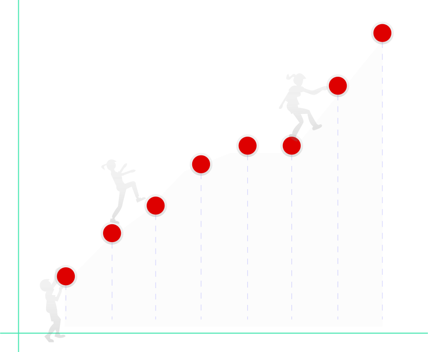

  
  <h1>CoronaAPI</h1>

  

    
    
Easy To Use

    
 Grab your favourite tools and consume our well defined <a href="https://data.corona-api.org/api-docs/" target="_blank" rel="noopener noreferrer" class="nav-link external">API</a>. 

  

  

    
    
It scales

    
The API is based on data collected via <a href="https://coronadatascraper.com/#home" target="_blank" rel="noopener noreferrer" class="nav-link external">scrapers</a>. The integration of more scrapers will amplify the power of the API. 

  

  

    
    
Open Source

    
 Both, the scraper collection and the API are <a href="https://github.com/CoronaAPI" target="_blank" rel="noopener noreferrer" class="nav-link external">open source</a> and everyone is welcome to contribute. 

  

## Our Aim

Our goal is to merge the power of all APIs regarding the current COVID-19 cases out there to one: **this Corona-API**. It is supposed to provide simplified access to verified datasets from all over the world. This enables everyone to perform further analyses, visualizations or simulations – without much effort and with a high degree of transparency. With this new consolidated API, we want to support developers, scientists, and journalists who in turn can communicate their findings to the public and decision makers.
The best thing is that it can be scaled up to handle new datasources that may become available in the future!

## How You Can Use The API

Our API is based on the [Corona Data Scraper](https://coronadatascraper.com/#home). This wonderful open-source project allows everyone to implement scrapers which gather COVID-19 related data. The Corona-API then provides a well-defined and easy to use gateway to this data. Using the Corona-API you can access structured up to date data without checking every scraper or data source separately. We will execute the scraper for you daily, save the results long-term, and serve them via our endpoints. For example, you can get all known cases of the COVID-19 pandemic and filter it for specific geographic locations or for certain timepoints.

Check out the [example section](/examples/) to see what the API can provide for you.

Your best bet is to look at our [Swagger documentation](https://data.corona-api.org/api-docs) to get more information on to how to use it.

## How You Can Contribute

You already have your own scraper and want to share it? Yay! We are open source and we’d be happy to include your datasets. It would be great if we team up to extend the API to more detailed data on regional occurrences in cities or rural municipalities for example.

You would like to participate and write your own scraper but don’t know how? [Find out!](https://github.com/lazd/coronadatascraper/#contributing)

Join our [Slack team](https://join.slack.com/t/corona-api/shared_invite/zt-d3q97q52-2~0Jh7YV1WHVDY~TpENVtg) :love_letter:

### Developed during #WirvsVirus Hackathon

  <iframe 
    max-width=100%
    height=auto src="https://www.youtube.com/embed/_ppUJZAvle0" 
    frameborder="0"
    allow="encrypted-media" 
    allowfullscreen>
  </iframe>

  <a style="font-weight: 300;" href="/impressum">Impressum</a>&ensp;| &nbsp;CoronaAPI &nbsp;| &nbsp;2020	©

