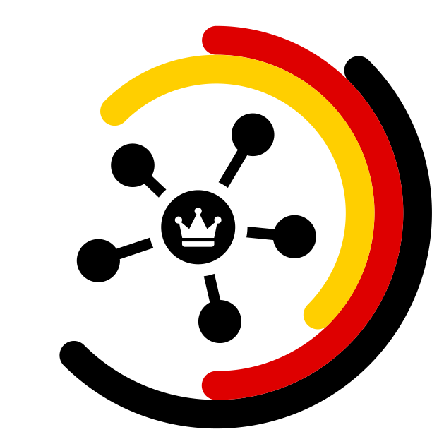

  

  

    
    
Easy To Use

    
 Grab your favourite tools and consume our well defined <a href=“https://corona.ndo.dev/api-docs/swagger-ui/“ target="_blank" rel="noopener noreferrer" class="nav-link external">API</a>. 

  

  

    
    
It scales

    
The API is based on data collected via scapers. The integration of more scrapers will amplify the power of the API. 

  

  

    
    
Open Source

    
 Both, the scraper collection and the API are open source and everyone is welcome to contribute. 

  

## Our Aim

Our goal is to merge the power of all APIs regarding the current COVID-19 cases out there to one: **this COVID-19-API**. It is supposed to provide simplified access to verified datasets from all over the world. This enables everyone to perform further analyses, visualizations or simulations – without much effort and with a high degree of transparency. With this new consolidated API, we want to support developers, scientists, or journalists who in turn can communicate their findings to the public or to decision makers.
The best thing is that it can be upscaled to handle more data that is available on the new SARS-CoV-2 virus and its related disease!

## How You Can Use The API

Our API is based on the [Corona Data Scraper](https://coronadatascraper.com/#home). This wonderful open-source project allows everyone to implement scrapers which gather COVID-19 related data. The COVID19-API then provides a well-defined and easy to use gateway to the data. Using the COVID19-API you can access structured real-time data without checking every scraper or data source separately. For example, you can get all known cases of the COVID-19 pandemic and filter it for specific geographic locations or for certain timepoints.

As of now, the API can give you the following case outputs:

- referred country
- source name and link
- timepoints

Your best bet is to look at our [Swagger documentation](https://corona.ndo.dev/api-docs/swagger-ui/) to get more information on to how to use it.

## How You Can Contribute

You already have your own scraper and want to share it? Yay! We are open source and we’d be happy to also include your datasets. It would be great if we team up to extend the API to more detailed data on regional occurrences in cities or rural municipalities for example.

You would like to participate and write your own scraper but don’t know how? [Find out!](https://github.com/lazd/coronadatascraper/#contributing)

### Developed during #WirvsVirus Hackathon

