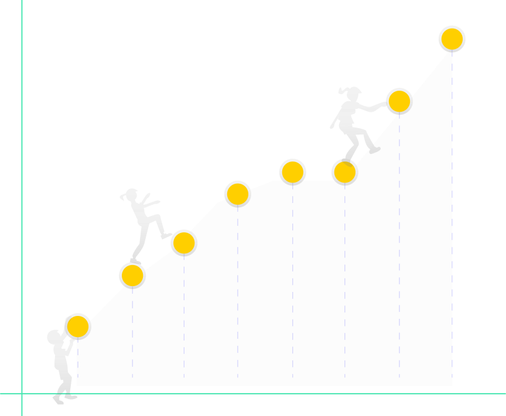

  <h1>CoronaAPI</h1>
  

  

    
    
Easy to use

    
beschreibung warum einfach

  

  

    
    
It scales

    
beschreibung warum gute skalierung

  

  

    
    
Open Source

    
beschreibung warum open source

  

## Our Aim 
Our goal is to merge the power of all APIs regarding the current COVID-19 cases out there to one: **this COVID-19-API**. It is supposed to provide simplified access to verified datasets from all over the world. This enables everyone to perform further analyses, visualizations or simulations – without much effort and with a high degree of transparency. 
And the best thing is that it can be upscaled to more data that is available on the new SARS-CoV-2 virus and its related disease!

## How You Can Use The API
In our API, we combine scrapers such as [this](https://coronadatascraper.com) so that you can easily access structured real-time data without checking every data source separately. You can for example get all known cases of the COVID-19 pandemia and filter it for a specific geographical location or for certain timepoints.
The best bet is to look at out Swagger documentation to get more information on how to use it.

As of now, the API can give you the following case outputs:
- referred country
- source name and link
- timepoints

**// Are there any prerequistes?**

## How You Can Contribute
You already have your own scraper and want to share it? Yay! We are open source and we'd be happy to also include your datasets. **//Hier den Verweis auf github?**

You would like to write your own scraper but don't know how? [Find out!](https://github.com/CoronaAPI/coronadatascraper) 

**// two buttons - guided page journey**

