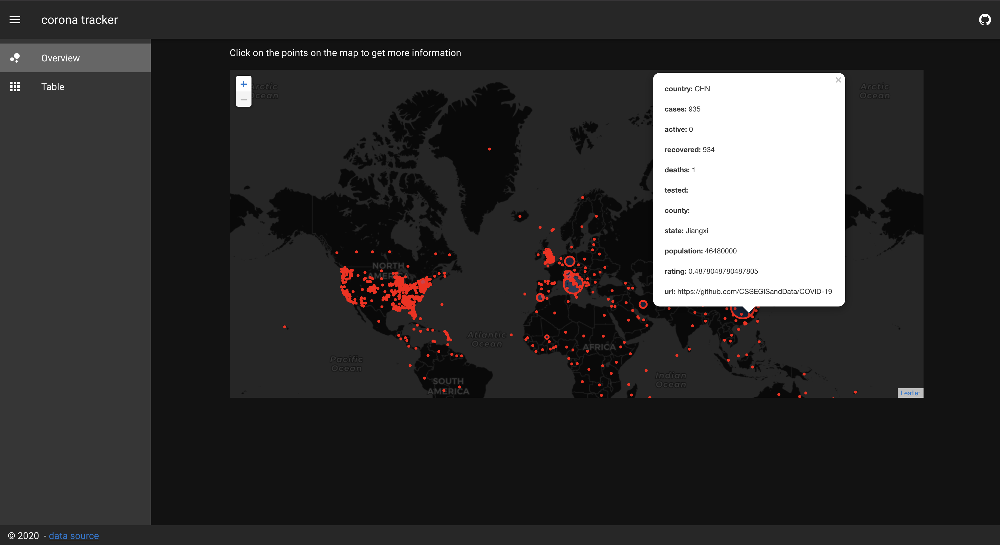

# Examples

This section helps you with examples so that you can easily obtain and use the required COVID19 data.

## Get all of today's data

To get all of today's data use the api endpoint you can find [here (/v1/daily).](https://data.corona-api.org/api-docs/#/Daily/get_v1_daily.).

When you click on the button, you request the daily data.

<corona-data />

If you add the query parameter "source" to the api request, you will get all data of this source.

e.g -> [/v1/daily?source=https://github.com/CSSEGISandData/COVID-19](https://data.corona-api.org/v1/daily?source=https://github.com/CSSEGISandData/COVID-19)

## Get all the different data sources

To get all the different data sources use the api endpoint you can find [here (/v1/datasources).](https://corona.ndo.dev/api-docs/#/Meta/get_v1_datasources).

When you click on the button, you request the list of all data sources.

<corona-data-sources />

## Get API metadata

To get the metadata use the api endpoint you can find [here (/meta).](https://data.corona-api.org/api-docs/#/Meta/get_meta).

When you click on the button, you request the metadata.

<corona-meta-data />

To implement the examples shown you can build a small [Vue](https://vuejs.org/) component. The data will be fetched with [axios](https://github.com/axios/axios) and stored locally in the component.

But it's up to you. Just choose your favorite tools and get the data via REST. If you click [here](https://data.corona-api.org/v1/daily), you will see the data in your browser. You can copy the data and use tools to parse it into the format you need (e.g. [json to csv](https://konklone.io/json/)).

<CodeSwitcher :languages="{vue:'Vue',react:'React'}">
<template v-slot:vue>

```js
<template>
  <div>
    <button class="data-btn" v-on:click="fetchCoronaDataSources">
      Get sources
    </button>
    <p v-if="isFetching">fetching data...</p>
    <div v-else style="margin: 5px">
      <div v-if="coronaSources.length > 0" style="height: 300px; overflow: auto;">
        <table>
          <tr>
            <th>source</th>
          </tr>
          <tr v-for="(source, index) in coronaSources" :key="index">
            <td>{{ source }}</td>
          </tr>
        </table>
      </div>
    </div>
  </div>
</template>

<script>
const axios = require("axios");

export default {
  name: "corona-data-sources",
  data() {
    return {
      coronaSources: [],
      fetch: axios,
      isFetching: false
    };
  },
  methods: {
    fetchCoronaDataSources() {
      this.isFetching = true;
      return this.fetch
        .get("https://data.corona-api.org/v1/datasources")
        .then(response => {
          this.$data.coronaSources= response.data;
          this.isFetching = false;
        })
        .catch(error => {
          this.isFetching = false;
          console.log(error);
        });
    }
  }
};
</script>
```

</template>
<template v-slot:react>

```js
import React from "react";
import ReactDOM from "react-dom";

const App = () => {
  const [data, setData] = React.useState({});

  fetch("https://data.corona-api.org/v1/datasources")
    .then(data => data.json())
    .then(resp => {
      setData(resp);
    })
    .catch(err => console.error(err));

  return (
    <ul>
      {data &&
        data.forEach(entry => {
          return <li> {entry} </li>;
        })}
    </ul>
  );
};

const element = <App />;
ReactDOM.render(element, document.getElementById("root"));
```

</template>
</CodeSwitcher>

## Build your own dashboard in minutes

Use open source frameworks and the CoronaAPI to create your own dashboard. For example, you could use the amazing [NuxtJS](https://nuxtjs.org/) framework to quickly implement the dashboard.

The [CoronaAPI-Dashboard](https://corona-api-dashboard.netlify.com/) uses the CoronaAPI and is an example of what you can do with easy to fetch data via REST. See the implementation at [GitHub](https://github.com/CoronaAPI/c-map)

<a href="https://corona-api-dashboard.netlify.com/" target="_blank" rel="noopener noreferrer" class="nav-link external">
  
</a>

<headway />
